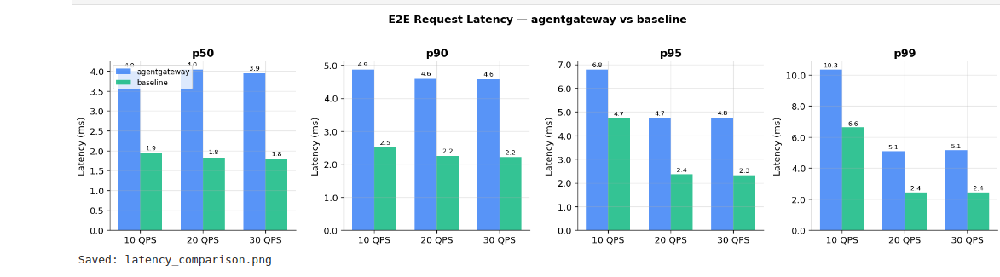
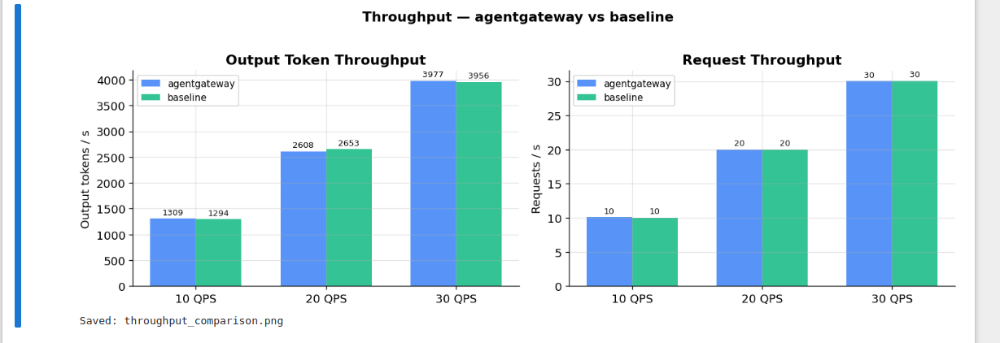
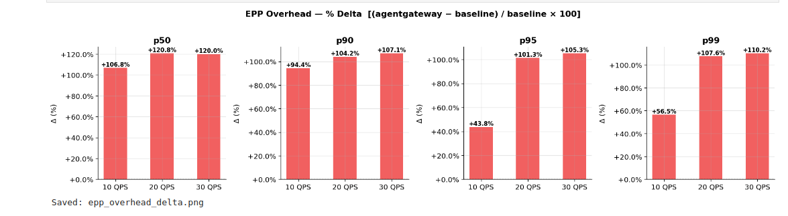
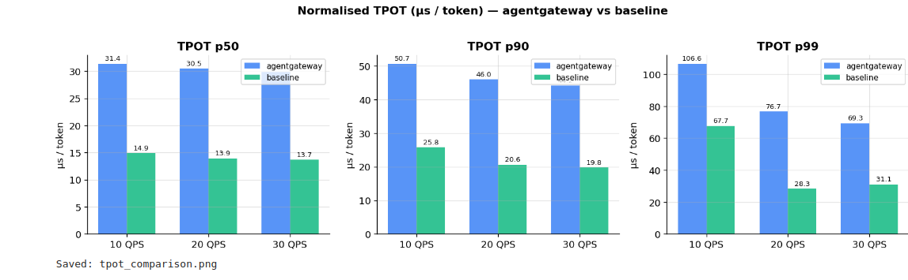

# agentgateway Inference Routing Benchmarks

End to end benchmark suite for measuring the overhead and routing benefit of agentgateway's inference routing stack compared to a plain k9s Service. This PoC runs entirely on a local kind cluster using `llm-d-inference-sim` in place of real GPU nodes, so you can validate the full benchmark pipeline on any laptop or CI machine.

## Benchmark scenario - Standard (please check gsoc proposal for more details)

**Aim:** Establish the baseline floor cost of agentgateway's EPP integration under *weak routing signal* - short prompts, balanced pods, no cache advantage. EPP has no routing benefit to offer, so the entire delta is pure ext_proc overhead.

**Dataset:** Synthetic, ShareGPT-like token distribution
- Input: mean 256 tokens (min 64, max 512)
- Output: mean 128 tokens (min 32, max 256)

**Load profile:** Constant rate, 3 stages

| Stage | QPS | Duration | Inter-stage gap |
|:-----:|:---:|:--------:|:---------------:|
| 0     | 10  | 20 s     | —               |
| 1     | 20  | 20 s     | none (back-to-back) |
| 2     | 30  | 20 s     | none            |

**Metrics collected per stage:**

| Metric | Field in JSON |
|--------|--------------|
| E2E request latency p50/p90/p95/p99 | `successes.latency.request_latency` |
| Normalised TPOT p50/p90/p99 | `successes.latency.normalized_time_per_output_token` |
| Output token throughput | `successes.throughput.output_tokens_per_sec` |
| Request throughput | `successes.throughput.requests_per_sec` |
| Failure count | `failures.count` |

## Results

Raw numbers:

| Metric                      | 10 QPS (AGW) | 10 QPS (Base) | 20 QPS (AGW) | 20 QPS (Base) | 30 QPS (AGW) | 30 QPS (Base) |
|----------------------------|-------------:|--------------:|-------------:|--------------:|-------------:|--------------:|
| Latency p50 (ms)           | 4.01         | 1.94          | 4.04         | 1.83          | 3.94         | 1.79          |
| Latency p90 (ms)           | 4.87         | 2.51          | 4.59         | 2.25          | 4.57         | 2.21          |
| Latency p95 (ms)           | 6.79         | 4.72          | 4.74         | 2.36          | 4.76         | 2.32          |
| Latency p99 (ms)           | 10.35        | 6.61          | 5.08         | 2.45          | 5.14         | 2.44          |
| TPOT p90 (µs)              | 50.67        | 25.81         | 45.96        | 20.60         | 44.16        | 19.77         |
| Output tokens/sec          | 1309.30      | 1294.10       | 2608.19      | 2653.24       | 3977.33      | 3955.90       |
| Requests/sec               | 10.06        | 10.02         | 20.00        | 20.01         | 30.02        | 30.07         |
| Failures                   | 0.00         | 0.00          | 0.00         | 0.00          | 0.00         | 0.00          |










Sanity check metrics:

| Metric                          | 10 QPS (AGW) | 10 QPS (Base) | 20 QPS (AGW) | 20 QPS (Base) | 30 QPS (AGW) | 30 QPS (Base) |
|---------------------------------|-------------:|--------------:|-------------:|--------------:|-------------:|--------------:|
| Achieved QPS                    | 10.1         | 10.0          | 20.0         | 20.0          | 30.0         | 30.1          |
| Mean prompt len (tokens)        | 253.8        | —             | 257.3        | —             | 257.5        | —             |
| Mean output len (tokens)        | 130.2        | —             | 130.4        | —             | 132.5        | —             |
| Total requests                 | 200.0        | —             | 400.0        | —             | 600.0        | —             |
| Successes                      | 200.0        | —             | 400.0        | —             | 600.0        | —             |
| Failures                       | 0.0          | 0.0           | 0.0          | 0.0           | 0.0          | 0.0           |

---

## Prerequisites

Install these before running anything:

- kind
- kubectl
- curl
- Python
- Jupyter Notebook
- matplotlib 
- numpy
- helm

---

## Step-by-step: run the full benchmark

### Step 1 — Clone the repo

```bash
git clone https://github.com/agentgateway/agentgateway.git
cd agentgateway
```

### Step 2 — Raise inotify limits (once per boot)

kind clusters run many pods (kube-proxy, coredns, controllers). The default Linux
inotify limits are too low and cause kube-proxy to crash with "too many open files",
which silently breaks all in-cluster API calls.

```bash
sudo sysctl fs.inotify.max_user_watches=524288
sudo sysctl fs.inotify.max_user_instances=512
```

To make this permanent across reboots:

```bash
echo 'fs.inotify.max_user_watches=524288' | sudo tee -a /etc/sysctl.d/99-kind.conf
echo 'fs.inotify.max_user_instances=512'  | sudo tee -a /etc/sysctl.d/99-kind.conf
```

### Step 3 — Set up the cluster

```bash
bash benchmarks/setup/install.sh
```

This runs two phases automatically:

**Phase 1** (~2 min) — kind cluster + inference-sim:
1. Installs helm to `~/.local/bin` if not already present
2. Creates a 3-node kind cluster named `agentgateway-bench`
3. Deploys 3 replicas of `inference-sim` in namespace `inference-benchmark`
4. Smoke-tests inference-sim directly via port-forward (expects HTTP 200)

**Phase 2** (~5 min) — agentgateway + EPP + routing resources:
1. Installs Gateway API v1.5.1 CRDs
2. Installs Istio base CRDs (required before controller starts — see Known Issues)
3. Installs agentgateway CRDs via local Helm chart
4. Installs agentgateway controller via Helm (patches startup probe to 10 min)
5. Waits up to 10 min for GatewayClass `agentgateway` to appear
6. Deploys EPP (endpoint picker) with correct RBAC
7. Creates Gateway, InferencePool, and HTTPRoute resources
8. Waits for EPP and data plane pods to become Ready
9. Smoke-tests the full agentgateway → EPP → inference-sim path (expects HTTP 200)

You can also run phases individually:

```bash
bash benchmarks/setup/install.sh --phase 1
bash benchmarks/setup/install.sh --phase 2
```

### Step 4 - Run the benchmark

```bash
bash benchmarks/scripts/run-benchmark.sh
```

This script:
1. Checks cluster readiness (gateway Programmed, EPP running)
2. Deletes any previous job runs
3. Applies the two inference-perf ConfigMaps
4. Submits both Jobs in parallel (`inference-perf-agentgateway` and `inference-perf-baseline`)
5. Waits up to 10 min for both Jobs to complete
6. Extracts the result JSON files from pod logs into `benchmarks/results/`
7. Prints a comparison table:

```
  Standard scenario results (agentgateway vs baseline)
   QPS    AGW p90 lat (ms)   Base p90 lat (ms)   EPP overhead (ms)   Failures
    10                 4.9                 2.5                 2.4          0
    20                 4.6                 2.2                 2.4          0
    30                 4.6                 2.2                 2.4          0
```

Results are saved to timestamped directories:

```
benchmarks/results/
├── agentgateway/
│   └── 20260405T094236Z/
│       ├── stage_0_lifecycle_metrics.json
│       ├── stage_1_lifecycle_metrics.json
│       ├── stage_2_lifecycle_metrics.json
│       └── summary_lifecycle_metrics.json
└── baseline/
    └── 20260405T094236Z/
        └── ...same files...
```

### Step 5 - Analyse results

```bash
cd benchmarks/analysis
jupyter notebook standard_scenario.ipynb
```

Run all cells. The notebook auto-discovers the most recent complete result run and
produces four chart files:

| File | Contents |
|------|----------|
| `latency_comparison.png` | Grouped bars: agentgateway vs baseline at p50/p90/p95/p99, per QPS stage |
| `throughput_comparison.png` | Output tokens/s and requests/s side by side |
| `epp_overhead_delta.png` | % delta `(agentgateway − baseline) / baseline × 100` at each percentile |
| `tpot_comparison.png` | Normalised time-per-output-token at p50/p90/p99 |

The notebook also prints a raw numbers table and sanity-check metrics (achieved QPS,
mean token lengths, failure counts).

### Step 7 - Tear down

```bash
bash benchmarks/setup/teardown.sh
```

Deletes the `agentgateway-bench` kind cluster entirely. All namespaces, Helm
releases, and CRDs are removed with it.

To remove only the benchmark workloads while keeping the cluster running.

---

## Manual smoke tests

After setup, verify both paths manually:

**agentgateway path** (through Rust proxy + EPP):

```bash
kubectl port-forward svc/benchmark-gateway 18080:8080 -n inference-benchmark &
curl -s -X POST http://localhost:18080/v1/chat/completions \
  -H "Content-Type: application/json" \
  -d '{"model":"meta-llama/Llama-3.1-8B-Instruct","messages":[{"role":"user","content":"hello"}],"max_tokens":10}' \
  | python3 -m json.tool
kill %1
```

**Baseline path** (direct to k8s Service, no gateway):

```bash
kubectl port-forward svc/baseline 18000:8000 -n inference-benchmark &
curl -s -X POST http://localhost:18000/v1/completions \
  -H "Content-Type: application/json" \
  -d '{"model":"meta-llama/Llama-3.1-8B-Instruct","prompt":"Hello","max_tokens":10}' \
  | python3 -m json.tool
kill %1
```

Both should return HTTP 200 with a valid completion response.

---

## Folder structure

```
benchmarks/
├── setup/
│   ├── install.sh              # Cluster setup (Phase 1 + 2); run this first
│   ├── teardown.sh             # Deletes the kind cluster
│   └── kind-config.yaml        # 3-node kind cluster definition
├── manifests/
│   ├── 00-namespace.yaml       # inference-benchmark namespace
│   ├── inference-sim/
│   │   ├── deployment.yaml     # 3-replica llm-d-inference-sim (simulates vLLM)
│   │   └── service.yaml        # ClusterIP service on port 8000
│   ├── agentgateway/
│   │   ├── helm-values.yaml    # Helm overrides for the agentgateway chart
│   │   ├── gateway.yaml        # Gateway resource (GatewayClass: agentgateway)
│   │   ├── inferencepool.yaml  # InferencePool → points EPP at inference-sim pods
│   │   ├── httproute.yaml      # HTTPRoute → InferencePool backend
│   │   └── epp/
│   │       ├── serviceaccount.yaml
│   │       ├── rbac.yaml       # Includes InferenceObjective list permission
│   │       ├── deployment.yaml # EPP v1.4.0
│   │       └── service.yaml    # gRPC port 9002
│   ├── baseline/
│   │   └── service.yaml        # Plain ClusterIP "baseline" service (same pods, no EPP)
│   └── inference-perf/
│       ├── configmap-agentgateway.yaml  # inference-perf config → agentgateway target
│       ├── configmap-baseline.yaml      # inference-perf config → baseline target
│       ├── job-agentgateway.yaml        # benchmark Job (agentgateway path)
│       └── job-baseline.yaml            # benchmark Job (baseline path)
├── scripts/
│   └── run-benchmark.sh        # Orchestrates the full benchmark run
├── analysis/
│   └── standard_scenario.ipynb # Jupyter notebook; produces comparison charts
├── results/                    # JSON output from inference-perf (gitignored)
└── README.md                   # This file
```
