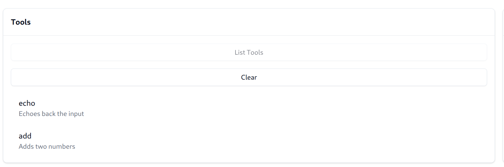
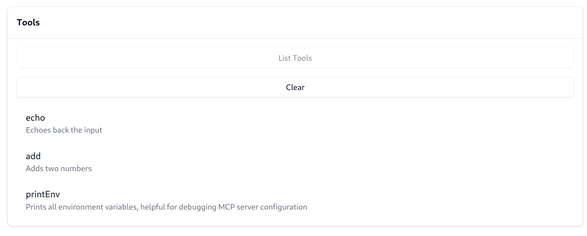

## Authorization Example

This example shows how to use the agentgateway to perform MCP native authorization.
It is recommended to complete the [basic](../basic) example before this one.

### Running the example

```bash
cargo run -- -f examples/authorization/config.yaml
```

In addition to the basic configuration from the [basic](../basic) example, we have a few new fields:

The `jwtAuth` indicates how to authenticate clients.
This uses example JWT keys and tokens included for demonstration purposes only.

```yaml
policies:
  jwtAuth:
    issuer: agentgateway.dev
    audiences: [test.agentgateway.dev]
    jwks:
      # Relative to the folder the binary runs from, not the config file
      file: ./manifests/jwt/pub-key
```

With this configuration, users will be required to pass a valid JWT token matching the criteria.
An example token signed by the key above can be found at `manifests/jwt/pub-key/example*.key`; this can be
passed into the MCP inspector `Authentication > Bearer Token` field.


Next, we add `mcpAuthorization` rules. These allow specifying criteria for who is allowed to access which resources.

```yaml
mcpAuthorization:
  rules:
  # Allow anyone to call 'echo'
  - 'permit(principal, action == Action::"call_tool", resource == Tool::"echo");'
  # Only the test-user can call 'add'
  - 'permit(principal == User::"test-user", action == Action::"call_tool", resource == Tool::"add");'
  # Any authenticated user with the claim `nested.key == value` can access 'printEnv'
  - |
    permit(principal is User, action == Action::"call_tool", resource == Tool::"printEnv") when 
    { context.claims.nested.key == "value" };
```

Agentgateway authorization rules are built on [CEL Policy](https://cel.dev/), a small language designed for authorization policies.
This allows complete flexibility to define simple or advanced access rules.

First, use the `example2.key`.
This key is for the user (`sub`) `test-user` and has no claims.
When we "List Tools", we can see the tools are filtered down to only `echo` and `add`, the two tools we have access to.



Next, use the `example1.key`.
This key is for the user (`sub`) `test-user` and has the following claims:

```json
{
  "field1": "value1",
  "nested": {
    "key": "value"
  },
  "list": ["apple", "banana"]
}
```

When we "List Tools", we can see the tools now additionally includes the `printEnv`.
This is because our third policy allows access `when { context.claims.nested.key == "value" }`, which now matches.



> [!TIP]
> When reconnecting, MCP inspector will not clear the cached tools list. Ensure you re-run "List Tools".

When the policy doesn't allow the connecting user to access a tool, it is automatically filtered from the tools list.
If the user does still attempt to call the tool, it is also denied.
