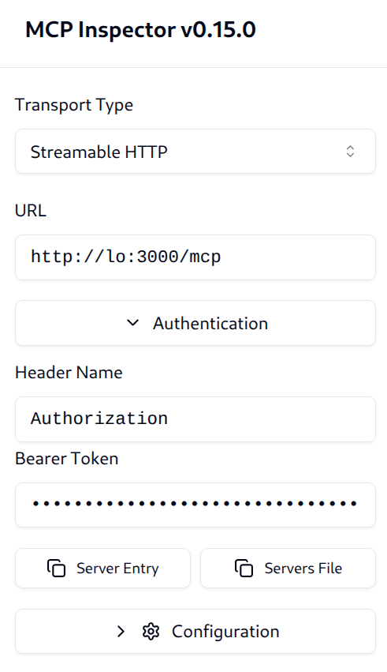
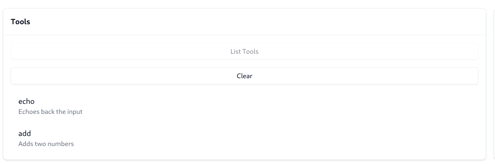
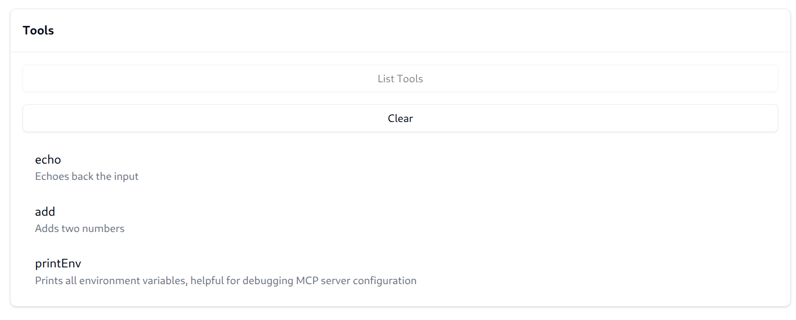

## Authorization Example

This example shows how to use the agentgateway to perform MCP native authorization.
It is recommended to complete the [basic](../mcp-basic) example before this one.

### Running the example

Start an upstream MCP server:

```bash
PORT=3001 npx -y @modelcontextprotocol/server-everything streamableHttp
```

Then start agentgateway:

```bash
cargo run -- -f examples/mcp-authorization/config.yaml
```

In addition to the basic configuration from the [basic](../mcp-basic) example, we have a few new fields:

The `jwtAuth` indicates how to authenticate clients.
This uses example JWT keys and tokens included for demonstration purposes only.

```yaml
policies:
  jwtAuth:
    issuer: agentgateway.dev
    audiences: [test.agentgateway.dev]
    jwks:
      # Relative to the folder the binary runs from, not the config file
      file: ./manifests/jwt/pub-key
```

With this configuration, users will be required to pass a valid JWT token matching the criteria.
An example token signed by the key above can be found at `manifests/jwt/example*.key`; this can be
passed into the MCP inspector `Authentication > Bearer Token` field.



Next, we add `mcpAuthorization` rules. These allow specifying criteria for who is allowed to access which resources.

```yaml
mcpAuthorization:
  rules:
  # Allow anyone to call 'echo'
  - 'mcp.tool.name == "echo"'
  # Only the test-user can call 'get-sum'
  - 'jwt.sub == "test-user" && mcp.tool.name == "get-sum"'
  # Any authenticated user with the claim `nested.key == value` can access 'get-env'
  - 'mcp.tool.name == "get-env" && jwt.nested.key == "value"'
```

Agentgateway authorization rules are built on [CEL](https://cel.dev/), a small expression language.
This allows complete flexibility to define simple or advanced access rules.

First, use the `example2.key`.
This key is for the user (`sub`) `test-user` and has no claims.
When we "List Tools", we can see the tools are filtered down to only `echo` and `get-sum`, the two tools we have access to.



Next, use the `example1.key`.
This key is for the user (`sub`) `test-user` and has the following claims:

```json
{
  "field1": "value1",
  "nested": {
    "key": "value"
  },
  "list": ["apple", "banana"]
}
```

When we "List Tools", we can see the tools now additionally includes the `get-env`.
This is because our third policy allows access when `jwt.nested.key == "value"`, which now matches.



> [!TIP]
> When reconnecting, MCP inspector will not clear the cached tools list. Ensure you re-run "List Tools".

When the policy doesn't allow the connecting user to access a tool, it is automatically filtered from the tools list.
If the user does still attempt to call the tool, it is also denied.

### External agent authority checks

Some deployments also need an agent-specific authority contract in addition to
JWT authentication and CEL authorization. For example, a team may want to allow
a support agent to read a customer record, but require human approval and a
short-lived grant before the same agent can update that record during a
particular support case.

One way to model that is to run an external authorization service before
forwarding selected MCP `tools/call` requests:

```text
MCP client -> agentgateway -> external authorization check -> MCP server
```

The external check should complement, not replace, agentgateway's existing
authorization policy. A typical request includes the authenticated user or
agent identity, MCP tool name, action, resource, job or case identifier, and any
approval or just-in-time grant metadata. The service returns an allow or deny
decision, and the gateway forwards the call only when both the local
`mcpAuthorization` policy and the external check allow it.

AgentID is one open-source example of this pattern. It defines a manifest for
agent tool-call authority and exposes an `/authorize` endpoint that can be used
as an external pre-tool-call check:

- AgentID: <https://github.com/dinpd/AgentID>
- Reference MCP gateway adapter: <https://github.com/dinpd/AgentID/tree/main/mcp-gateway-adapter>
- Demo walkthrough: <https://github.com/dinpd/AgentID/blob/main/docs/mcp-gateway-demo.md>

This pattern keeps downstream MCP servers unchanged while giving platform teams
a place to enforce job boundaries, approval requirements, just-in-time grants,
and structured decision logging for sensitive agent tool calls.
