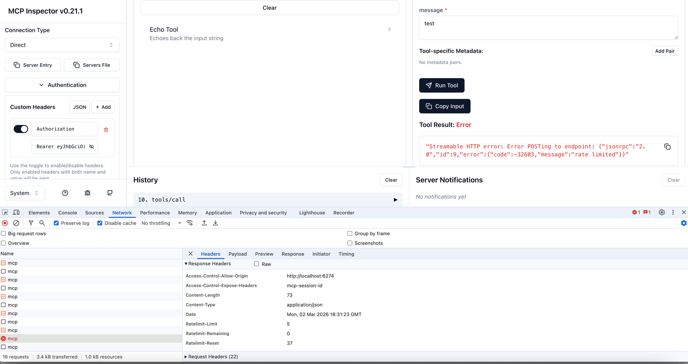

## MCP Backend-Level Rate Limiting Example

This example shows how to use `mcpRemoteRateLimit` to apply rate limiting at the MCP backend level using Envoy's ratelimit server and Redis backend.

Unlike the [global](../global) example which applies `remoteRateLimit` at the HTTP route level, `mcpRemoteRateLimit` operates inside the MCP policy pipeline. This means:

- Rate limiting is evaluated using MCP-aware CEL context (`mcp.tool.name`, `mcp.prompt.name`, etc.)
- For single-target requests (e.g., `call_tool`), the rate limit check runs after authorization
- For fanout requests (e.g., `list_tools`), the rate limit check runs before the fanout to all backends
- Rate limit response headers (`X-RateLimit-Remaining`, etc.) are forwarded to the client

### Running the example

First, start the Redis and ratelimit server:

For Linux:
```bash
docker run -d --name redis --network host redis:7.4.3
docker run -d --name ratelimit \
  --network host \
  -e REDIS_URL=127.0.0.1:6379 \
  -e USE_STATSD=false \
  -e LOG_LEVEL=trace \
  -e REDIS_SOCKET_TYPE=tcp \
  -e RUNTIME_ROOT=/data \
  -e RUNTIME_SUBDIRECTORY=ratelimit \
  -v $(pwd)/examples/ratelimiting/mcp-backend/ratelimit-config.yaml:/data/ratelimit/config/config.yaml:ro \
  envoyproxy/ratelimit:3e085e5b \
  /bin/ratelimit -config /data/ratelimit/config/config.yaml
```

For macOS:
```bash
docker run -d --name redis -p 6379:6379 redis:7.4.3
docker run -d --name ratelimit \
  -p 8081:8081 -p 8080:8080 -p 6070:6070 \
  -e REDIS_URL=host.docker.internal:6379 \
  -e USE_STATSD=false \
  -e LOG_LEVEL=trace \
  -e REDIS_SOCKET_TYPE=tcp \
  -e RUNTIME_ROOT=/data \
  -e RUNTIME_SUBDIRECTORY=ratelimit \
  -e LIMIT_RESPONSE_HEADERS_ENABLED=true \
  -v $(pwd)/examples/ratelimiting/mcp-backend/ratelimit-config.yaml:/data/ratelimit/config/config.yaml:ro \
  envoyproxy/ratelimit:3e085e5b \
  /bin/ratelimit -config /data/ratelimit/config/config.yaml
```


Then start the agentgateway:

```bash
cargo run -- -f examples/ratelimiting/mcp-backend/config.yaml
```

### Configuration

The `mcpRemoteRateLimit` policy uses CEL expressions to extract descriptor values from the MCP request context:

```yaml
policies:
  mcpRemoteRateLimit:
    domain: "mcp-ratelimit"
    host: "127.0.0.1:8081"
    descriptors:
      - entries:
          - key: "user"
            value: 'jwt.sub'
          - key: "tool"
            value: 'mcp.tool.name'
        type: "requests"
```

- `jwt.sub` extracts the subject from the JWT token
- `mcp.tool.name` extracts the tool name from MCP `call_tool` / `list_tools` requests


### Authentication before rate limiting

The `jwtAuth` configuration uses the example JWT keys and tokens included for demonstration purposes only.

```yaml
policies:
  jwtAuth:
    issuer: agentgateway.dev
    audiences: [test.agentgateway.dev]
    jwks:
      file: ./manifests/jwt/pub-key
```

With this configuration, users will be required to pass a valid JWT token matching the criteria.
An example token signed by the key above can be found at `manifests/jwt/example1.key`; this can be
passed into the MCP inspector `Authentication > Bearer Token` field.

### Rate limit server configuration

The rate limit configuration defines:
- **Combined limit**: 5 requests/minute for `(user=test-user, tool=echo)`
- **Tool limit**: 3 requests/minute for `tool=echo`

### Testing

Use the MCP inspector with the JWT token:

```bash
npx @modelcontextprotocol/inspector
```




Send multiple `call_tool` requests for the `echo` tool. After exceeding the limit, the gateway returns a JSON-RPC error with `429 Too Many Requests` and includes `X-RateLimit-*` headers.

To monitor rate limiting behavior:

```bash
docker logs -f ratelimit | grep -E '(OVER_LIMIT|OK)'
```
