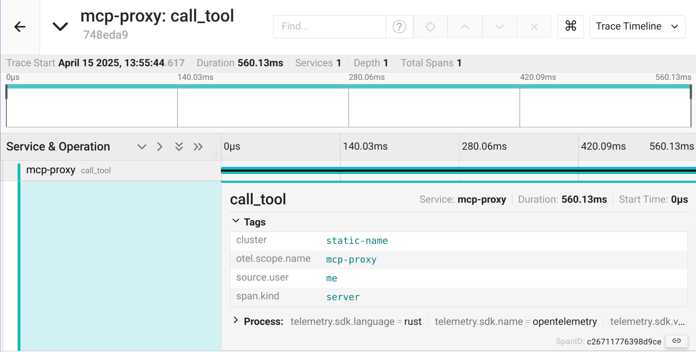

## Telemetry Example

This example shows how to use the agentgateway to visualize traces and metrics for MCP calls.
This builds upon the [RBAC sample](../authorization).
While you can use tracing without RBAC, this example uses both together to showcase augmenting traces with information from the authenicated user.

### Running the example

```bash
cargo run -- -f examples/telemetry/config.yaml
```

Let's look at the config to understand what's going on.

In addition to the baseline configuration we had previously, we have a new `config` `tracing` section, which tells the proxy how to trace requests.

```yaml
config:
  tracing:
    otlpEndpoint: http://localhost:4317
```

Here, we configure sending traces to an [OTLP](https://opentelemetry.io/docs/specs/otel/protocol/) endpoint.

For metrics, they are enabled by default so no configuration is needed

Next, we will want to get a tracing backend running.
You can use any OTLP endpoint if you already have one, or run a local [Jaeger](https://www.jaegertracing.io/) instance by running `docker compose up -d`

Send a few requests from the MCP inspector to generate some telemetry.

Now we can open the [Jaeger UI](http://localhost:16686/search) and search for our spans:



We can also see the metrics (typically, Prometheus would scrape these):

```
$ curl -H 'Accept: application/openmetrics-text' localhost:15020/metrics -s | grep -v '#'
tool_calls_total{server="everything",name="echo"} 1
tool_calls_total{server="everything",name="add"} 1
list_calls_total{resource_type="tool"} 3
agentgateway_requests_total{gateway="bind/3000",method="POST",status="200"} 9
agentgateway_requests_total{gateway="bind/3000",method="POST",status="202"} 4
agentgateway_requests_total{gateway="bind/3000",method="GET",status="200"} 1
agentgateway_requests_total{gateway="bind/3000",method="DELETE",status="202"} 2
```

## Metrics Formats

The metrics can be retrived in either OpenMetrics text format or protobuf, controlled via the `Accept` header on the request. Specifying multiple formats with a quality parameter will cause the gateway to choose the best match of highest quality (standard accept header behaviour).

If you use protobuf, the returned data is of `io.prometheus.client.MetricsSet`, not customisable via the `proto=<type>` accept header parameter. Ideally, this should be deserialised using the offical [OpenMetrics protobuf definition](https://github.com/prometheus/OpenMetrics/blob/main/proto/openmetrics_data_model.proto).

For text format use one of:
* `Accept: text/plain`
* `Accept: application/openmetrics-text`

For Protobuf use one of:
* `Accept: application/vnd.google.protobuf`
* `Accept: application/protobuf`
* `Accept: application/x-protobuf`

